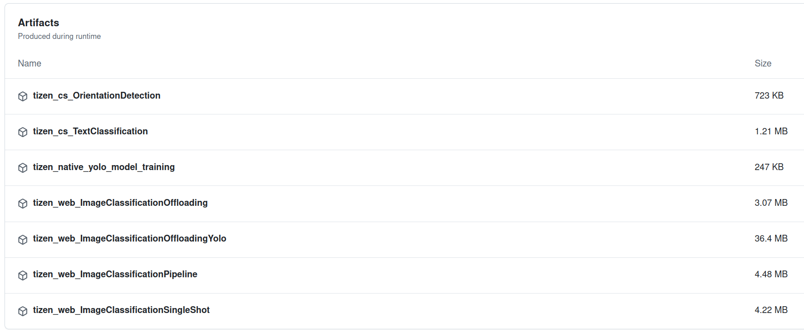
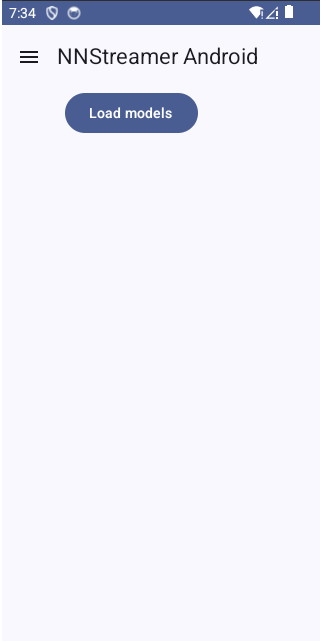
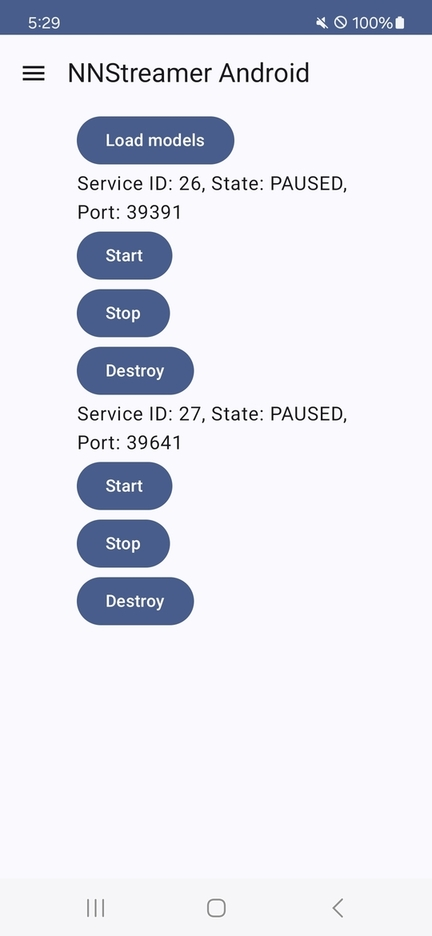
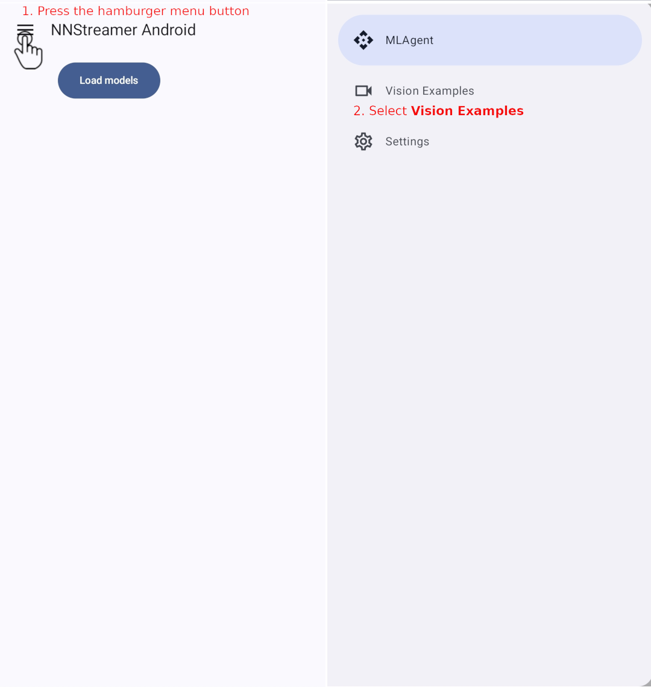
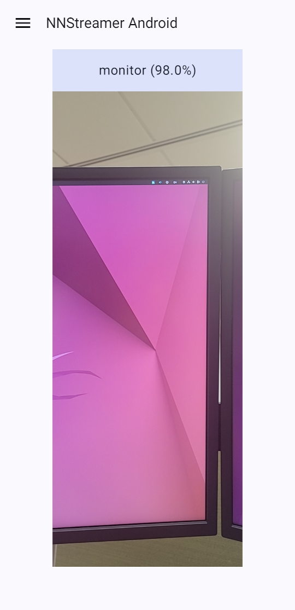
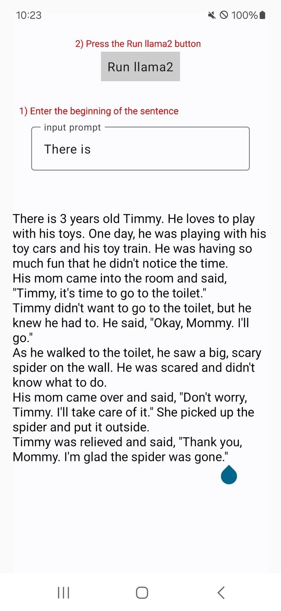

# How to Configure the Tizen-to-Android Offloading Scenario

## Client Application (Tizen)

### Prerequisites

#### Installing Tizen Studio 5.6

To build Tizen Applications, you need to install Tizen Studio. In this document, we are going to use
Tizen Studio 5.6 with CLI. You can download Tizen Studio
from [here](https://developer.tizen.org/development/tizen-studio/download?langredirect=1#).

Alternatively, you can install Tizen Studio by using the following command:

```bash
$ wget https://download.tizen.org/sdk/Installer/tizen-studio_5.6/web-cli_Tizen_Studio_5.6_ubuntu-64.bin
```

Next, change the working directory to the directory where you downloaded the installer, and run the
installer:

```bash
$ cd $WORKING_DIRECTORY
$ ls web-cli_Tizen_Studio_5.6_ubuntu-64.bin
web-cli_Tizen_Studio_5.6_ubuntu-64.bin
$ chmod +x web-cli_Tizen_Studio_5.6_ubuntu-64.bin

$ ./web-cli_Tizen_Studio_5.6_ubuntu-64.bin --accept-license

...omitted...

Installer will install to =>  ~/tizen-studio

Preparing installation...

...omitted...

[100%] =>
Installation has been completed!
Thank you for using Installer
```

Note that the above command installs Tizen Studio and its data to `~/tizen-studio`
and `~/tizen-studio-data`, respectively, by default.

#### Downloading Required Packages

Next step is to download the required packages using Tizen Studio's Package Manager. Those packages
are required to build the Tizen application and run the application on a Tizen emulator or a real
target device.

```bash
$ cd ~/tizen-studio/package-manager
$ ls package-manager-cli.bin
package-manager-cli.bin

$ ./package-manager-cli.bin install TIZEN-8
Package Manager (0.5.54)

****************************************
******* Start to update packages *******
****************************************
Nothing to update.

****************************************
****** Start to install packages *******
****************************************
Under packages will be installed.
         * Emulator
         * TIZEN-8.0-Emulator
         * NativeToolchain-Gcc-9.2
         * NativeCLI
         * TIZEN-8.0-NativeAppDevelopment-CLI
         * Certificate-Manager
         * WebIDE
         * TIZEN-8.0-WebAppDevelopment
         * TIZEN-8.0-WebFramework-TAU-CLI
         * TIZEN-8.0-WebFramework-TAU
         * NativeIDE
         * TIZEN-8.0-NativeAppDevelopment

...omitted...

Installation has been completed.
```

#### Launching a Tizen 8.0 Virtual Machine

To launch a Tizen 8.0 Virtual Machine, you need to use Emulator Manager included in Tizen Studio.

```bash
$ cd ~/tizen-studio/tools/emulator/bin
$ ls em-cli
em-cli
```

`em-cli` is the command line tool to manage Tizen platform images and virtual machines.

```bash
$ ./em-cli -h
Usage: em-cli [global options] <COMMAND> [command options]

Global options
  -h, --help                 Print this help and exit
  -h, --help <COMMAND>       Print help of specified COMMAND and exit
  -v, --verbose              Run verbosely
  -V, --version              Print version of emulator manager and exit

Commands
  create            Create a new virtual machine
  delete            Delete a virtual machine
  launch            Launch a virtual machine
  list-vm           Display the list of all virtual machines
  list-platform     Display the list of available platforms
  list-template     Display the list of available device templates
  detail            Print the detailed information of a virtual machine
  modify            Modify configurations of a virtual machine
  reset             Reset a virtual machine's disk image
  create-image      Create a new platform image
```

At the current state, `Tizen-8.0 on x86` and `Tizen-8.0 on x64` are already installed, which means
that there is no need to download the additional materials. `list-vm` and `list-platform` are
helpful commands to list all available virtual machines and platforms, respectively.

```bash
$ ./em-cli list-vm
T-8.0-x86
T-8.0-x86_64

$ ./em-cli list-platform
tizen-8.0-x86
tizen-8.0-x86_64
```

Next, launch a Tizen 8.0 Virtual Machine:

```bash
$ ./em-cli launch T-8.0-x86_64
```

You will see the following screen to select several options: language, region, EULA, and Wi-Fi
network.


Then, your Tizen 8.0 emulator is ready to use, as shown below.


#### Launching a Tizen 8.0 Device

To launch a Tizen 8.0 device, you need to flash an image to Raspberry Pi(RPI) according
to [this guide](https://docs.tizen.org/platform/developing/flashing-rpi/).
Please
select [Tizen-8.0 Headed](https://download.tizen.org/snapshots/TIZEN/Tizen-8.0/Tizen-8.0-Unified/latest/images/standard/)
in the Download binaries step. Fusing-script for `Flash through the command line` step has expired,
so use this [script](sd_fusing_rpi3.sh) instead. You must complete the Install drivers step to use
Wi-Fi.

If the image is flashed successfully, you can see rpi4 in the list of devices attached.

```bash
$ cd ~/tizen-studio/tools/emulator/bin
$ ls sdb
sdb
$ ./sdb devices
List of devices attached
10000000afbaa640    	device    	rpi4
```

When you connect the RPI and a monitor using a micro HDMI cable, you can select language, region,
EULA, and Wi-Fi network same as emulator.
Wi-Fi can be connected later in settings, as shown below.


### Building the Tizen Web App

#### Cloning the GitHub Repository

The Tizen Web App can be found on the GitHub
repository [here](https://github.com/nnstreamer/nnstreamer-example/tree/main/Tizen.web/ImageClassificationOffloading).
To build it, you need to clone the repository first.

```bash
$ git clone https://github.com/nnstreamer/nnstreamer-example
Cloning into 'nnstreamer-example'...
remote: Enumerating objects: 3249, done.

...omitted...

$ ls
nnstreamer-example
$ cd nnstreamer-example/Tizen.web/ImageClassificationOffloading
$ ls
config.xml  css  icon.png  image_classification_offloading.png  images  index.html  js  README.md  res
```

#### Building and Packaging the Web App using Tizen CLI

The Tizen CLI is a command-line tool for building, packaging, and installing the Tizen application
and running it on a Tizen emulator or a real target device. It is included in Tizen Studio and you
can find the binary file `tizen` in the directory `~/tizen-studio/tools/ide/bin`.

```bash
$ pushd ~/tizen-studio/tools/ide/bin
$ ls tizen
tizen
$ ./tizen version
Tizen CLI 2.5.25
$ popd
```

To build the Web App, you need to specify the command, ```build-web```.

```bash
$ export PATH=$HOME/tizen-studio/tools/ide/bin:$PATH
$ pwd
nnstreamer-example/Tizen.web/ImageClassificationOffloading

$ tizen build-web -- .
Build Web Application:  100% (10/10)

BUILD SUCCESSFUL

Output path : nnstreamer-example/Tizen.web/ImageClassificationOffloading/.buildResult
```

The Web App is built and the output is located in the directory `.buildResult`.

Next, package the Web App using the command, ```package```, with the ```-t wgt``` option.

```bash
$ pwd
nnstreamer-example/Tizen.web/ImageClassificationOffloading

$ tizen package -t wgt -- .buildResult
WARNING: Default profile is used for sign. This signed package is valid for emulator test only.

...omitted...

Package File Location: nnstreamer-example/Tizen.web/ImageClassificationOffloading/.buildResult/ImageClassificationOffloading.wgt
```

Tizen supports [hybrid application](https://docs.tizen.org/application/web/#hybrid-application-package), which combines a web application and 1 or more native servics.
We need a hybrid app to get the port value automatically from the offloading service.

```bash
$ cd nnstreamer-example/Tizen.web/ImageClassificationOffloadingService
$ tizen build-native -a arm -c llvm -C Debug -- .
[PLATFORM] Tizen-8.0
...omitted...
Total time: 00:00:00.314

$ tizen package -t tpk -- Debug
Initialize... OK
...omitted...
Package File Location: nnstreamer-example/Tizen.web/ImageClassificationOffloadingService/Debug/EQmf4iSfpX-1.0.0-arm.tpk

$ cd nnstreamer-example/Tizen.web/ImageClassificationOffloading
$ tizen package -t wgt -r ../ImageClassificationOffloadingService/Debug/EQmf4iSfpX-1.0.0-arm.tpk  -- .buildResult/ImageClassificationOffloading.wgt
The active profile is used for signing. If you want to sign with other profile, please use '--sign' option.
...omitted...
Package( nnstreamer-example/Tizen.web/ImageClassificationOffloading/.buildResult/ImageClassificationOffloading.wgt ) is created successfully.
```
Tizen Web App build process is done automatically through [github actions](https://github.com/nnstreamer/nnstreamer-example/actions/workflows/tizen-build.yml).
So if you don't need to build it yourself, you can download `tizen_web_ImageClassificationOffloading` created from `main` branch.



### Running the Tizen Web App on the Tizen Emulator

As mentioned above, the Tizen CLI supports installing and running the Tizen Web App on the Tizen
emulator or the real target device. The remaining will only address the installation and running on
the Tizen emulator. To list Tizen emulator instances currently running on your host machine, use the
command, ```sdb``` in ```~/tizen-studio/tools```.

```bash
$ export PATH=$HOME/tizen-studio/tools:$PATH
$ sdb devices
List of devices attached
emulator-26101          device          T-8.0-x86_64
```

In the above example, you can see the Tizen emulator instance, `emulator-26101`. We are going to
install the ```wgt``` package into this instance.

```bash
$ pwd
nnstreamer-example/Tizen.web/ImageClassificationOffloading

$ tizen install -n ./.buildResult/ImageClassificationOffloading.wgt -s emulator-26101
...omitted...
Installed the package: Id(EQmf4iSfpX)
spend time for pkgcmd is [192]ms

Tizen application is successfully installed.
Total time: 00:00:00.496
```

Note that ```EQmf4iSfpX``` is the package ID of the installed package. The command, ```run``` of the
Tizen CLI requires the package ID as an argument.

```bash
$ tizen run -p EQmf4iSfpX -s emulator-26101
... successfully launched pid = 3125 with debug 0

Tizen application is successfully launched.
```

If you can see the user interface in the following screenshot, the web app has been successfully
launched on the Tizen emulator.


### Running the Tizen Web App on the Tizen Device

Installing and running the Tizen application on the Tizen device is exactly the same as with an
emulator.

```bash
$ tizen install -n ./.buildResult/ImageClassificationOffloading.wgt -t rpi4
path is /opt/usr/home/owner/share/tmp/sdk_tools/tmp/ImageClassificationOffloading.wgt
...omitted...
Installed the package: Id(EQmf4iSfpX)
spend time for pkgcmd is [3012]ms

Tizen application is successfully installed.
Total time: 00:00:04.302

$ tizen run -p EQmf4iSfpX -t rpi4
... successfully launched pid = 1625 with debug 0

Tizen application is successfully launched.
```

## Server Application (Android)

### Prerequisites

#### Installing Gradle 8.6

Installation of Gradle is described in the [Gradle documentation](https://gradle.org/install/). The
following is a brief description of the installation procedure from
the [Gradle documentation](https://gradle.org/install/).

- `Gradle` runs on major operating systems and requires only a [Java JDK](https://adoptopenjdk.net/)
  version 8 or higher to be installed. To check, run `java -version`:

    ```bash
    $ java --version
    openjdk 21.0.2 2024-01-16
    ```

- [SDKMAN!](http://sdkman.io/) is a tool for managing parallel versions of multiple Software
  Development Kits on most Unix-based systems. Other package managers are available, but the version
  of Gradle distributed by them is not controlled by Gradle, Inc. Linux package managers may
  distribute a modified version of Gradle that is incompatible or incomplete when compared to the
  official version (available from SDKMAN! or below).
    ```bash
    $ curl -s "https://get.sdkman.io" | bash
    ...omitted...

    Please open a new terminal, or run the following in the existing one:

    source "${HOME}/.sdkman/bin/sdkman-init.sh"

    ...omitted...

    $ source "${HOME}/.sdkman/bin/sdkman-init.sh"
    ```

    ```
    $ sdk install gradle 8.6
     Downloading: gradle 8.6
     ...omitted...
    Done installing!
    ```

#### Installing Android SDK and NDK

The official installation guide of Android Studio is available on
the [Install Android Studio](https://developer.android.com/studio/install) page. It is common to use
Android Studio's [SDK Manager](https://developer.android.com/studio/intro/update#sdk-manager) with a
GUI to install and update the packages required for developing Android applications. However, in
this document, we will use the command-line tool, `sdkmanager`, in order to describe the minimal
required packages and their specific versions explicitly.

To download Android Command Line Tools, visit [here](https://developer.android.com/studio) and find
the link in the **Command line tools only** section. Alternatively, you can use the following
command to download it.

```bash
$ wget https://dl.google.com/android/repository/commandlinetools-linux-11076708_latest.zip
$ ls commandlinetools-linux-11076708_latest.zip
commandlinetools-linux-11076708_latest.zip
$ unzip commandlinetools-linux-11076708_latest.zip
$ cd cmdline-tools/bin
$ ls
apkanalyzer  avdmanager  lint  profgen  resourceshrinker  retrace  screenshot2  sdkmanager
```

The native parts of GStreamer and NNStreamer requires a specific version, *25.2.9519653*, of the
Android NDK.

```bash
$ ls # make sure that you are in the cmdline-tools/bin directory
apkanalyzer  avdmanager  lint  profgen  resourceshrinker  retrace  screenshot2  sdkmanager

$ ./sdkmanager --sdk_root=${HOME}/Android/Sdk --install "ndk;25.2.9519653"
```

If the `Android` directory (including its child directory, `Sdk`) is not present, it will be
created, and the NDK will be installed as well.

```bash
$ ls ${HOME}/Android/Sdk
licenses  ndk
```

Next, you need to install the Android SDK packages required for developing Android applications.

```bash
$ ls # make sure that you are in the cmdline-tools/bin directory
apkanalyzer  avdmanager  lint  profgen  resourceshrinker  retrace  screenshot2  sdkmanager

$ ./sdkmanager --sdk_root=${HOME}/Android/Sdk --install "platforms;android-34" "build-tools;34.0.0" "platform-tools"
...omitted...
```

### Building the Android App

#### Cloning the GitHub Repository

The Android app's GitHub repository can be found here. To build it, you need to clone the repository
first. If you clone with recursive option, you can receive the submodule together.

```bash
$ git clone --recursive https://github.com/nnstreamer/nnstreamer-android

$ ls nnstreamer-android/
build.gradle.kts  externals  gradle  gradle.properties  gradlew  gradlew.bat  LICENSE  ml_inference_offloading  nnstreamer-api  README.md  settings.gradle.kts
$ cd nnstreamer-android
```

To build the application with ml-service feature, you need to set the feature ```feature.mlService=true``` in the [gradle.properties](/gradle.properties).

#### Building the Android App using Gradle

In the `nnstreamer-android` directory, `Gradle Wrapper` files have already been generated. You can
check out the tasks this `Wrapper` provides by running the following command.

```bash
$ ./gradlew tasks
------------------------------------------------------------
Tasks runnable from root project 'nnstreamer-android'
------------------------------------------------------------

Android tasks
-------------
androidDependencies - Displays the Android dependencies of the project.
signingReport - Displays the signing info for the base and test modules
sourceSets - Prints out all the source sets defined in this project.

Build tasks
-----------
assemble - Assembles the outputs of this project.
assembleAndroidTest - Assembles all the Test applications.
assembleUnitTest - Assembles all the unit test applications.
build - Assembles and tests this project.

...omitted...

test - Run unit tests for all variants.
testDebugUnitTest - Run unit tests for the debug build.
testReleaseUnitTest - Run unit tests for the release build.
updateLintBaseline - Updates the lint baseline using the default variant.

To see all tasks and more detail, run gradlew tasks --all

To see more detail about a task, run gradlew help --task <task>

BUILD SUCCESSFUL in 1m 51s
1 actionable task: 1 executed

```

Among the tasks shown above, the `build` task is the one that we will use to build the project.

```bash
$ ./gradlew build
...omitted..
BUILD SUCCESSFUL in 8m 42s
209 actionable tasks: 209 executed
```

Alternatively, you can build each submodule as follows.

```bash
$ ls
build.gradle.kts  externals  gradle  gradle.properties  gradlew  gradlew.bat  LICENSE  ml_inference_offloading  nnstreamer-api  README.md  settings.gradle.kts

$ ./gradlew externals:build
...omitted...

$ ./gradlew nnstreamer-api:build
...omitted...

$ ./gradlew ml_inference_offloading:build
...omitted...
BUILD SUCCESSFUL in 2m 18s
193 actionable tasks: 21 executed, 172 up-to-date
```

Note that the App's directory name of the App submodule is `ml_inference_offloading`.

```bash
$ find ./ml_inference_offloading/ -name "*.apk"
./ml_inference_offloading/build/outputs/apk/debug/ml_inference_offloading-debug.apk
./ml_inference_offloading/build/outputs/apk/release/ml_inference_offloading-release-unsigned.apk
```

#### Building the Android App with llama2

The following steps are required to run an LLM task (i.e., Llama2) via the Android app.

##### Preparing the llama2 model and the configuration file

We need a pair of the model and tokenizer files for an LLM task. You can download a small model for the Android device using this [guide](https://github.com/karpathy/llama2.c/tree/master?tab=readme-ov-file#custom-tokenizers).

```bash
$ ls
model.bin tok4096.bin

$ mv model.bin nnstreamer-android/ml_inference_offloading/src/main/assets/models/llama2c.bin
$ mv tok4096.bin nnstreamer-android/ml_inference_offloading/src/main/assets/models/tokenizer.bin
```

We provide llama2.c as an example [configuration file](/documentation/example_conf/llama2c.conf).
To use it, copy the configuration file to the assets directory.

```bash
$ cp documentation/example_conf/llama2c.conf ml_inference_offloading/src/main/assets/models
```

##### Building the llama2.c for Android

To build the application with llama2.c, you need to indicate the directory where llama2.c is placed via the ```dir.llama2c``` property in the [gradle.properties](/gradle.properties).

```
dir.llama2c=llama2.c
```

### Running the Android App on the Target Device

#### Running the Android App on the Android Emulator

##### Preparing the Android Emulator

To run the Android App on the Android Emulator, An Android Virtual Device (AVD) must be created
first. It is highly recommended to use the `Virtual Device Manager` included in
the `Android Studio` (You can see the details in
the [Android Studio](https://developer.android.com/studio/run/managing-avds) documentation).
However, this document explains how to create the AVD using the `avdmanager` command.

First, you need to download the system image for the Android Emulator. T

```bash
$ ./sdkmanager --sdk_root=${HOME}/Android/Sdk --install "system-images;android-34;google_api;x86_64"
```

The above command will install the `emulator` package as well.

Note that `avdmanager` is included in the `cmdline-tools/bin` directory. To make `avdmanager`
recognize the above system image installed into the `${HOME}/Android/Sdk`, the following steps are
required.

```bash
$ mkdir ${HOME}/Android/Sdk/cmdline-tools

$ ls # make sure that you are in the cmdline-tools/bin directory
apkanalyzer  avdmanager  lint  profgen  resourceshrinker  retrace  screenshot2  sdkmanager

$ cp -rf $(pwd)/../cmdline-tools ${HOME}/Android/Sdk/cmdline-tools/latest
$ cd ${HOME}/Android/Sdk/cmdline-tools/latest/bin
$ ls
apkanalyzer  avdmanager  lint  profgen  resourceshrinker  retrace  screenshot2  sdkmanager
```

Then, you can create a named AVD using the following command.

```bash
$ ./avdmanager create avd -n Android34_GAPI-x64 -k "system-images;android-34;google_apis;x86_64"
[=======================================] 100% Fetch remote repository...
Auto-selecting single ABI x86_64
Do you wish to create a custom hardware profile? [no]

$ ./avdmanager list avd
Available Android Virtual Devices:
    Name: Android34_GAPI-x64
    Path: /home/wook/.android/avd/Android34_GAPI-x64.avd
  Target: Google APIs (Google Inc.)
          Based on: Android 14.0 ("UpsideDownCake") Tag/ABI: google_apis/x86_64
  Sdcard: 512 MB

$ cd ${HOME}/Android/Sdk/emulator
$ ./emulator -avd Android34_GAPI-x64
```

Finally, the Android Virtual Device named `Android34_GAPI-x64` is ready to use.


##### Running the App on the Android Emulator

The app is installed on the Android Emulator using the `adb install PACKAGE` command,
where `PACKAGE` is the name of the `.apk` file, the Gradle build's output. For example, you can find
the `.apk` file of the `ml_inference_offloading` module in
the `nnstreamer-android/ml_inference_offloading/build/outputs/apk/[debug|release]` directory.

```bash
$ cd ${HOME}/Android/Sdk/platform-tools
$ ls adb
adb

$ ./adb devices
List of devices attached
emulator-5554   device
```

Let's assume that `nnstreamer-android` above was cloned in the `${HOME}/nnstreamer-android`
directory

```bash
$ pwd
~/Android/Sdk/platform-tools

$ ./adb install ${HOME}/nnstreamer-android/ml_inference_offloading/build/outputs/apk/debug/ml_inference_offloading-debug.apk
Performing Streamed Install
```

- Troubleshooting: If you get the following error
  message, `INSTALL_FAILED_INSUFFICIENT_STORAGE: Failed to override installation location`, you need
  to increase the size of the internal storage of the Android Emulator.
    - Increase the value of **disk.dataPartition.size** in
      ${HOME}/.android/avd/Android34_GAPI-x64.avd/config.ini
    - For example,
  ```bash
  $ cat ${HOME}/.android/avd/Android34_GAPI-x64.avd/config.ini | grep disk.dataPartition.size*
  disk.dataPartition.size = 16384m
  ```

After the installation has been completed, you can run the app on the Android Emulator using
the `adb shell am start` command.

```bash
$ pwd
~/Android/Sdk/platform-tools

$ $ ./adb shell am start ai.nnstreamer.ml.inference.offloading/ai.nnstreamer.ml.inference.offloading.MainActivity
Starting: Intent { act=android.intent.action.MAIN cat=[android.intent.category.LAUNCHER] cmp=ai.nnstreamer.ml.inference.offloading/.MainActivity }
```

If you can see the same user interface as the following screenshot, the Android app has been
successfully launched on the AVD.


#### Running the Android App on the Android Device

##### Preparing the Android Device

To connect Android device to the host PC, you can follow
this [guide](https://developer.android.com/codelabs/basic-android-kotlin-compose-connect-device#0)

##### Running the App on the Android Device

The Android device can also use `adb` to install and run the app.

```bash
$ cd ${HOME}/Android/Sdk/platform-tools
$ ls adb
adb

$ ./adb devices
List of devices attached
R3CW90D8TNR	device

$ ./adb install ${HOME}/nnstreamer-android/ml_inference_offloading/build/outputs/apk/debug/ml_inference_offloading-debug.apk
Performing Streamed Install
Success

$ ./adb shell am start ai.nnstreamer.ml.inference.offloading/ai.nnstreamer.ml.inference.offloading.MainActivity
Starting: Intent { act=android.intent.action.MAIN cat=[android.intent.category.LAUNCHER] cmp=ai.nnstreamer.ml.inference.offloading/.MainActivity }
```

If you can see the same user interface as the following screenshot, the Android app has been
successfully installed and launched on the device.


## Results

### Run Tizen-to-Android Offloading

To run Tizen-to-Android Offloading you need to connect both devices to the same Wi-Fi network or
ethernet. Press the load models button on the Android device to run the offloading service
based on the conf files. Then, the port number to which the service is listening will display
on the screen like the following screenshot.



Tizen devices automatically find offloading services using the model ID. When the image
classification task runs successfully, the detected label and inference time are displayed on
the screen as shown below.


The devices used to capture the screenshots are Galasy S24 and Raspberry Pi4.

### ML Computation Delegation scenario

#### Handling ML Computation Delegation Requests from the Android Components in the Same package

The MLAgent service can also handle the ML Computation requests from the other components in the same package. In order to demonstrate this scenario, we added a simple Activity example to the `ml_inference_offloading` package. This example uses the Android CameraX API to take a picture and send it to the MLAgent service for inference. Then, MLAgent service handles the requests using the bundled models and returns the result to the calling component.

To change the screen to the demonstrate the scenario, 1) open the modal navigation drawer and 2) select the **Vision Examples**. Note that to open the navigation drawer you need to press [the hamburger menu button](https://fonts.google.com/icons?selected=Material+Symbols+Outlined:menu:FILL@0;wght@400;GRAD@0;opsz@24&icon.size=24&icon.color=%235f6368&icon.platform=android) on the top left corner of the screen. The detail procedure to change the screen is shown in the following screenshots.



After changing the screen, you can see the **Camera Preview** and the real-time object classification result above the preview box as shown below.



#### Handling ML Computation Delegation Requests from the Android Components in the Other package

The MLAgent can handle the delegation requests from the other package. The following code should be added to the other package's `AndroidManifest.xml`
for [package visibility](https://developer.android.com/training/package-visibility/declaring).

```xml
<manifest xmlns:android="http://schemas.android.com/apk/res/android"
    xmlns:tools="http://schemas.android.com/tools">
    <queries>
        <package android:name="ai.nnstreamer.ml.inference.offloading" />
        <package android:name="ai.nnstreamer.ml.inference.offloading.MainService" />
    </queries>
    ...
</manifest>
```

We are providing a simple example application that demonstrates this scenario. This example sends an input prompt to the MLAgent
and retrieves the generated output text using the llama2 model.

To receive auto-generated text by llama2 model, 1) enter the beginning of the sentence and 2) press the `Run llama2` button.



If you want to build this example, you can follow [the guide](https://github.com/nnstreamer/nnstreamer-example/blob/main/android/kotlin_app/README.md).
